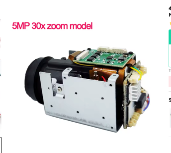

> 🇺🇦 [Українська версія](README.uk.md)

# Camera Viewer

A web app for browsing IP camera recordings directly from the SD card in a browser.

## Compatible Hardware

Built and tested with a **5MP 30× optical zoom** IP camera module (HiXVision/HiSilicon-based).

[](https://s.click.aliexpress.com/e/_c4MdieUV)

🛒 [Buy on AliExpress](https://s.click.aliexpress.com/e/_c4MdieUV)

**Camera documentation:**
- [Camera manual](docs/camera-manual.html)
- [Product datasheet (PDF)](docs/zoom_cam.pdf)

## Purpose

The camera stores video and photos on a built-in SD card as raw H.264/H.265 files with no convenient viewing interface. This app acts as a local web viewer: it connects to the camera over the network, parses the SD card directory structure, and provides a clean UI with a timeline, video player, and motion event gallery.

## Features

- **24-hour timeline** — all recordings for the day as coloured segments (blue = periodic, orange = motion alert). Zoom with mouse wheel, pinch gesture on phone or trackpad; double-click to reset zoom
- **Video player** — play recordings directly in the browser. The camera writes in a non-standard format (HXVF wrapper over H.264/H.265); the app automatically converts via ffmpeg to MP4
- **Playback speed** — logarithmic slider from 0.1× to 16×
- **Auto-play next** — automatically plays the next clip when the current one ends
- **Motion event gallery** — thumbnail photos from the motion detector, filterable by camera channel, with lazy loading on scroll
- **Lightbox** — full-screen photo viewer
- **Language switcher** — Ukrainian / English, remembered in the browser
- **Date navigation** — previous/next buttons between days that have recordings
- **Keyboard shortcuts** — `←` / `→` to navigate clips, `Esc` to close lightbox
- **Video cache** — transcoded files are stored on disk to support seeking. Auto-eviction: maximum 500 MB or 7 days
- **Authentication** — login with camera credentials; session persists across page reloads

## Requirements

- Python 3.9+
- [ffmpeg](https://ffmpeg.org/) on the system PATH
- IP camera with HTTP access to the SD card (compatible with HiXVision/HiSilicon)

## Getting Started

```bash
# 1. Install dependencies
python -m venv .venv
source .venv/bin/activate
pip install -r requirements.txt

# 2. Configure
cp .env.example .env
# Edit .env: set the camera address and a secret key

# 3. Run
python app.py
```

Open in browser: `http://localhost:<PORT>` (port from `.env`, default `5000`)

## Configuration

| Variable | Default | Description |
|---|---|---|
| `CAMERA_HOST` | `192.168.1.100:80` | Camera address (host:port) |
| `SECRET_KEY` | `dev-secret-key` | Flask session secret key (change for production) |
| `PORT` | `5000` | Web server port |

## Project Structure

```
app.py                  # Flask backend: camera proxy, video conversion
templates/index.html    # HTML markup
static/css/main.css     # Styles (dark theme)
static/js/main.js       # UI logic: timeline, player, gallery
requirements.txt        # Python dependencies
.env.example            # Configuration template
```
